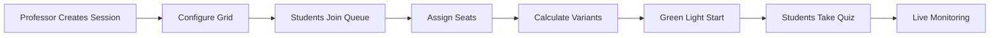
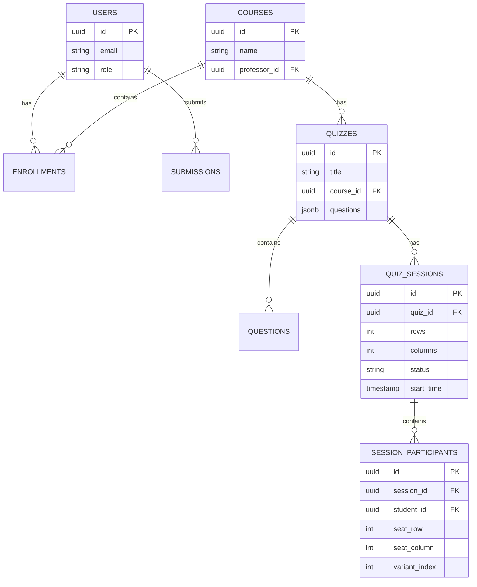

# 🎓 ProctorLess

<p align="center">
  
</p>

<p align="center">
  <strong>Privacy-First Smart Assessment Platform with Real-Time Integrity Detection</strong>
</p>

<p align="center">
  <a href="#-features"><strong>Features</strong></a> ·
  <a href="#-tech-stack"><strong>Tech Stack</strong></a> ·
  <a href="#-getting-started"><strong>Getting Started</strong></a> ·
  <a href="#-architecture"><strong>Architecture</strong></a> ·
  <a href="#-database-schema"><strong>Database</strong></a>
</p>

<p align="center">
  
  
  
  
</p>

---

## 📋 Overview

ProctorLess is a modern, privacy-respecting online assessment platform designed for educational institutions. Unlike traditional proctoring software that relies on invasive monitoring, ProctorLess uses smart question distribution and behavioral analysis to maintain exam integrity.

### Key Differentiators

- **🔒 Privacy-First**: No webcam monitoring or screen recording
- **🎯 Smart Distribution**: Latin Square algorithm ensures adjacent students get different questions
- **📊 Real-Time Monitoring**: Live dashboard for professors without invasive surveillance
- **🤖 AI-Powered**: Gemini integration for question parsing and variant generation

---

## ✨ Features

### For Professors

| Feature | Description |
|---------|-------------|
| **Course Management** | Create courses and enroll students |
| **Quiz Builder** | Upload questions via images/PDFs with AI parsing |
| **Multi-File Upload** | Batch upload and parse multiple question sources |
| **Session Control** | Configure seating grids and assign variants |
| **Live Dashboard** | Real-time student progress monitoring |
| **AI Grading** | Automated grading with Gemini AI |

### For Students

| Feature | Description |
|---------|-------------|
| **Waiting Room** | Join quiz sessions and receive seat assignments |
| **Synchronized Start** | Fair "green light" start for all students |
| **Variant Assignment** | Receive unique question set based on seat |
| **Clean Interface** | Focus-friendly quiz-taking experience |

### For Admins

| Feature | Description |
|---------|-------------|
| **User Management** | Manage roles and permissions |
| **System Overview** | View all courses, quizzes, and users |
| **Integrity Logs** | Review tab-switch and activity logs |

### 🧩 Chrome Extension

The **ProctorLess Integrity Monitor** is a lightweight Chrome extension that works alongside the web platform.

| Feature | Description |
|---------|-------------|
| **Tab Monitoring** | Detects when students switch tabs during quizzes |
| **Activity Logging** | Sends tab-switch events to the platform API |
| **Privacy-Respecting** | Only logs tab switches, no screenshots or webcam |
| **Auto-Connect** | Seamlessly integrates with active quiz sessions |

#### Extension Installation

1. Navigate to `chrome://extensions/` in Chrome
2. Enable **Developer mode** (top right toggle)
3. Click **Load unpacked**
4. Select the `proctorless-extension` folder from this repository
5. The extension icon will appear in your toolbar

#### Extension Files

```
proctorless-extension/
├── manifest.json       # Extension configuration
├── background.js       # Service worker for tab monitoring
├── content.js          # Content script injection
├── popup.html          # Extension popup UI
├── popup.js            # Popup logic
└── icons/              # Extension icons
```

---

## 🏗 Architecture

```
┌─────────────────────────────────────────────────────────────────┐
│                        Frontend (Next.js 16)                     │
├──────────────────┬──────────────────┬──────────────────────────┤
│   Auth Pages     │   Dashboard      │   Quiz Engine            │
│   /auth/*        │   /dashboard     │   /dashboard/quiz/[id]   │
├──────────────────┴──────────────────┴──────────────────────────┤
│                        API Routes                                │
│   /api/gemini/*  │  /api/admin/*   │  /api/integrity/*         │
└──────────────────┬──────────────────┬──────────────────────────┘
                   │                  │
                   ▼                  ▼
┌──────────────────────────────────────────────────────────────────┐
│                     Supabase Backend                              │
├────────────────┬─────────────────┬─────────────────┬────────────┤
│   PostgreSQL   │   Auth          │   Storage       │   Realtime  │
│   (Database)   │   (Users)       │   (Files)       │   (Live)    │
└────────────────┴─────────────────┴─────────────────┴────────────┘
```

### Seating-Aware Distribution Flow



### Latin Square Algorithm

Adjacent students never receive the same question variant:

```
Formula: variantIndex = ((row × 3) + column) % totalVariants

Example 4x4 Grid with 3 Variants:
┌───┬───┬───┬───┐
│ A │ B │ C │ A │
├───┼───┼───┼───┤
│ C │ A │ B │ C │
├───┼───┼───┼───┤
│ B │ C │ A │ B │
├───┼───┼───┼───┤
│ A │ B │ C │ A │
└───┴───┴───┴───┘
```

---

## 🛠 Tech Stack

| Layer | Technology |
|-------|------------|
| **Framework** | Next.js 16 (App Router + Turbopack) |
| **Language** | TypeScript 5 |
| **Styling** | Tailwind CSS + shadcn/ui |
| **Database** | Supabase (PostgreSQL) |
| **Auth** | Supabase Auth |
| **AI** | Google Gemini API |
| **Realtime** | Supabase Realtime |
| **Storage** | Supabase Storage |

---

## 🚀 Getting Started

### Prerequisites

- Node.js 18+
- Supabase account
- Google Gemini API key (optional, for AI features)

### Installation

1. **Clone the repository**
   ```bash
   git clone https://github.com/Taif6612/proctorless-app.git
   cd proctorless-app
   ```

2. **Install dependencies**
   ```bash
   npm install
   ```

3. **Configure environment**
   ```bash
   cp .env.example .env.local
   ```
   
   Update `.env.local` with your credentials:
   ```env
   NEXT_PUBLIC_SUPABASE_URL=your_supabase_url
   NEXT_PUBLIC_SUPABASE_ANON_KEY=your_anon_key
   GEMINI_API_KEY=your_gemini_key
   ```

4. **Run database migrations**
   
   Execute the SQL files in Supabase SQL Editor:
   - `QUIZ_TABLES_SETUP.sql`
   - `SEATING_MIGRATION.sql`
   - Enable Realtime for `quiz_sessions` and `session_participants`

5. **Start development server**
   ```bash
   npm run dev
   ```
   
   Open [http://localhost:3003](http://localhost:3003)

---

## 🗄 Database Schema



---

## 📁 Project Structure

```
proctorless-app/
├── app/
│   ├── api/              # API routes
│   │   ├── admin/        # Admin endpoints
│   │   ├── gemini/       # AI extraction & variations
│   │   └── integrity/    # Tab monitoring
│   ├── auth/             # Authentication pages
│   ├── dashboard/        # Main dashboard
│   │   ├── course/       # Course management
│   │   ├── quiz/         # Quiz pages
│   │   │   └── [id]/
│   │   │       ├── session/   # Professor session control
│   │   │       ├── waiting/   # Student waiting room
│   │   │       └── live/      # Live monitoring
│   │   └── results/      # Results dashboard
│   └── admin/            # Admin panel
├── components/           # Reusable UI components
├── lib/                  # Utilities
│   ├── supabase/         # Supabase clients
│   └── seating.ts        # Latin Square algorithm
└── supabase/
    ├── functions/        # Edge functions
    └── migrations/       # Database migrations
```

---

## 🔐 Security

- **Row Level Security (RLS)**: All tables protected with granular policies
- **Role-Based Access**: Professor, Student, Admin roles
- **Secure Authentication**: Supabase Auth with session management
- **Protected Routes**: Middleware ensures authorized access

---

## 🤝 Contributing

1. Fork the repository
2. Create a feature branch (`git checkout -b feature/amazing-feature`)
3. Commit changes (`git commit -m 'Add amazing feature'`)
4. Push to branch (`git push origin feature/amazing-feature`)
5. Open a Pull Request

---

## 📄 License

This project is licensed under the MIT License.

---

## 👥 Team

Built with ❤️ for modern education.

---

<p align="center">
  <strong>ProctorLess</strong> — Making assessments fair, private, and intelligent.
</p>
